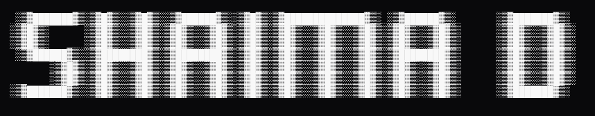

Security engineering student at ECE Paris, specializing in AI security and purple team operations.
Currently at [Sopra Steria](https://www.soprasteria.com/) (D&S / Homeland Security) building autonomous AI agents for zero-day vulnerability detection and hardening CI/CD pipelines at continental scale.

I break things in CTFs, build things that break other things, and think a lot about what happens when LLMs end up in security-critical systems.

---

## Work

**Security Engineer Intern — Sopra Steria D&S** *(Apr–Aug 2026)*  
Autonomous AI agents for zero-day detection in isolated environments. SCA/SBOM industrialization via Dependency-Track across a continent-wide CI/CD pipeline. Exploitability assessment and compliance auditing of sensitive application modules.

**SOC Analyst Intern — OSIIC** *(Jan–Feb 2025)*  
Incident correlation on telecom networks via SIEM. Built an ML model for intelligent log classification. Tuned correlation rules — 20% reduction in false positives.

**Fullstack Developer Intern — STATION F** *(Dec 2023–Feb 2024)*  
Built and shipped the web interface for a Station F startup. Frontend integration, motion design, SEO optimization. Worked across teams on acquisition strategy and brand positioning.

---

## Projects

**[LLMsec](https://github.com/shm0m/LLMsec)** — Fuzzer for RAG pipelines. Tests context injection, vector database privilege escalation, and model poisoning scenarios. Built to stress-test the assumptions most teams make when they ship RAG to production.

**[M.I.R.A](https://github.com/shm0m/M.I.R.A)** — Quadruped robot with embedded AI. Handles locomotion, real-time decision making, and environmental adaptation on constrained hardware.

**[LFS-Pain](https://github.com/shm0m/LFS-Pain)** — Linux built from scratch. Toolchain, kernel, core utilities, bootloader. Every layer compiled by hand until it boots.

**[VM-0verride](https://github.com/shm0m/VM-0verride)** — Experimental kernel with native colorblind support. Unusual problem, unusual approach.

**[Malware-AI-Prediction](https://github.com/shm0m/Malware-AI-Prediction)** — ML-based malware classification using TensorFlow. Trained on behavioral features, not signatures.

---

## CTF & Community

[Root-Me](https://www.root-me.org/shm0m) — 1500+ points. Focus on web exploitation, reverse engineering, and advanced scripting.  
[TryHackMe](https://tryhackme.com/) — Security Engineer path, certified.  
[0xECE](https://github.com/0xECE) — Active member. Offensive/defensive workshops, vulnerability research.

---

## Stack

Offensive: Nmap · Metasploit · Burp Suite · Kali · Ghidra · Cutter  
Defensive: SIEM · Wireshark · Autopsy · Dependency-Track · Forensics  
AI/ML: Python · TensorFlow · PyTorch · Ollama · ChromaDB · LoRA  
Infra: Docker · Kubernetes · OpenShift · Ansible · CI/CD  
Dev: C · ASM · Bash · TypeScript · Node.js · React

---

[Portfolio](https://shaima-drh.vercel.app) · [LinkedIn](https://linkedin.com/in/shaima-d) · [Root-Me](https://www.root-me.org/shm0m) · [shaima.derouich@proton.me](mailto:shaima.derouich@proton.me)