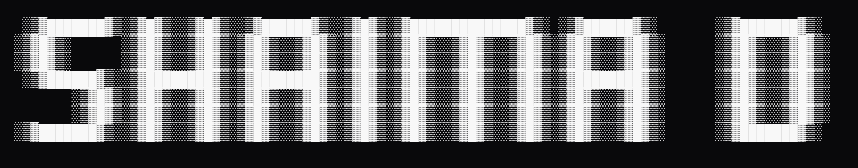

<h1 align="center">Shaïma Derouich</h1>

  <b>Aspiring Security Engineer</b> · MEng, Cybersecurity @ ECE Paris 
  Agentic AI × offensive security × LLM red teaming

  
  
  

  
  

---

## About

From sovereign-grade environments to startups, I learned to secure fast and break even faster.
My edge: **find the flaw, prove it by exploiting it, then teach AI to hunt it continuously.**

I break things in CTFs, build things that break other things, and think a lot about what happens when LLMs end up in security-critical systems.

**Targeting:** AI Security Engineer, AI Safety Engineer or AppSec Engineer. 

---

## Now

- **AI Safety Researcher (capstone, partner startup, under NDA)**: red teaming frontier LLMs against OWASP Top 10 for LLM and MITRE ATLAS. Since Sep 2026.
- **KASCAD**: a security harness for agentic AI. Findings are reported only after proof of exploitability, never on a bare LLM verdict.
- **ARGOS**: research on refusal directions in LLM activation space (alignment ablation and detection).

---

## Experience

| When | Role | What I did |
|---|---|---|
| **Apr to Aug 2026** | **AI Security Engineer**, Sopra Steria (Homeland Security) | Designed and deployed an agentic AI engine that maps and prioritizes risk (OWASP, CWE, CVE), then proposes fixes (Blue Team) or exploitation vectors (Red Team). Hardened production CI/CD pipelines with integrated scanners. **F1 of 92.7% on SCA; 5/7 critical flaws found vs 0/7 for classic SAST/DAST scanners.** |
| **Jan to Feb 2025** | **SOC Analyst**, OSIIC (classified networks) | Real-time detection and incident response through a SIEM, 100+ alerts/day. Built an unsupervised ML model to tune EDR thresholds: **20% fewer false positives**. |
| **Dec 2023 to Feb 2024** | **Software Engineer**, STATION F | Modernized and shipped a full web platform (Next.js, React, TypeScript, Supabase) for an incubated startup: **40% faster load time**. |

---

## Projects

| Project | Description |
|---|---|
| **KASCAD** | Multi-agent AI system for application security with a hardened MCP layer (allowlist, non-repudiable audit, human validation on risky actions). *Python, MCP* |
| **ARGOS** | Locating refusal directions in an open-source LLM's activation space. *Python, PyTorch* |

---

## CTF & Community

- [**Root-Me**](https://www.root-me.org/klawd): 2100+ points. Web exploitation, reverse engineering, scripting.
- [**0xECE**](https://github.com/0xECE): active member of the ECE cybersecurity club. Offensive/defensive workshops, CTFs, threat intelligence watch.

---

## Stack

  

| | |
|---|---|
| **Offensive** | Nmap · Metasploit · Burp Suite · Kali · Ghidra · Threat Modeling |
| **Defensive** | SIEM · Wireshark · Forensics · Linux Hardening · MITRE ATT&CK · Dependency-Track |
| **AI / ML** | Python · PyTorch · TensorFlow · Scikit-Learn · LangChain · RAG · MCP · Ollama · LoRA |
| **Infra / DevOps** | Docker · Kubernetes · OpenShift · Ansible · GitLab CI/CD |
| **Dev** | C · ASM · Rust · Bash · TypeScript · Node.js · React · SQL |

---

## GitHub

  
  

---

  <i>Always down to talk deeptech.</i> 
  <a href="mailto:shaima.derouich@proton.me">shaima.derouich@proton.me</a>

